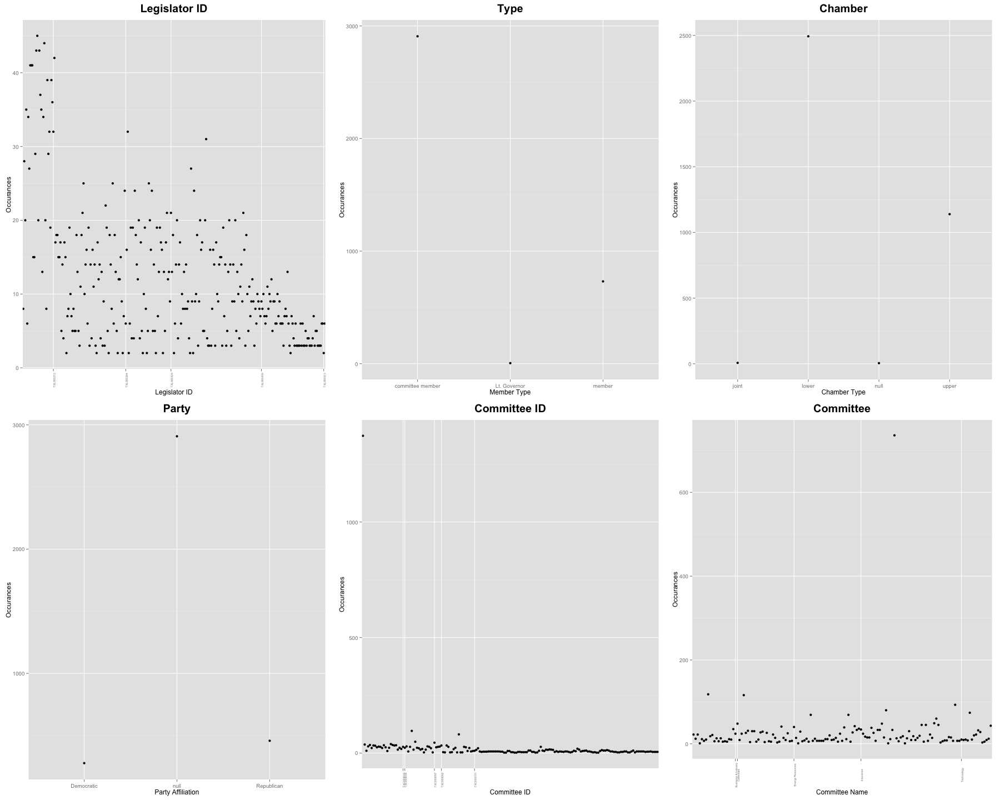
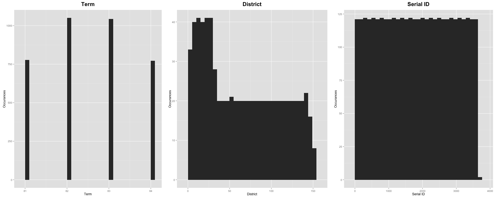

For this project, several csv files contain related information about Texas legislators and their comittees were imported into a remote OracleDB.

##Importing Dataframes
The first step is to initialize the required packages for this project
```{r}
source("../01_Data/Packages.R", echo=TRUE)
```

Next, we will build our dataframe. We grab the data from the Oracle Database with a SQL query. The following dataframe shown is the head of the whole dataframe.
```{r}
source("../01_Data/Dataframe.R", echo=TRUE)
```

##Data Wrangling
We now use the data wrangling to filter and join dataframes together for analysis.

The following are the datasets wrangled for analysis purposes using the tables Legislator and Legislator_Roles.

```{r}
source("../02_Data_Wrangling/Wrangling.R", echo=TRUE)
```

The first dataset filters the joined table see the relationship between the committee and the names of the legislators in it.

The second dataset filters down the joined table to view the number of active legislators and inactive legislators in each committtee.

The last dataset examines the name and term of selected legislators as well as their party affiliation.

##Visualization
Finally, we can visualize the filtered datasets from the step from above.

```{r}
source("../03_Visualizations/Visualization.R", echo=TRUE)
```

The first visualization suggested that each committee is correlated with a certain chamber. There are also many legislators serving in each committeee from different affiliations.

The second visualization showed that the number of inactive members are not significantly higher than active members. This may be due to the fact that the data tables only account for terms from 81 to 83.

The last visualization provides a segment of the legislator's party and the term they served.

Finally, the following are visualization of categorical and measure columns:
```{r}
source("../03_Visualizations/Categorical.R", echo=FALSE)
```

There raw plots are not organized, so the information seem very messy. We use visual formatting for those categorical visualizations to gain the following graphs:


